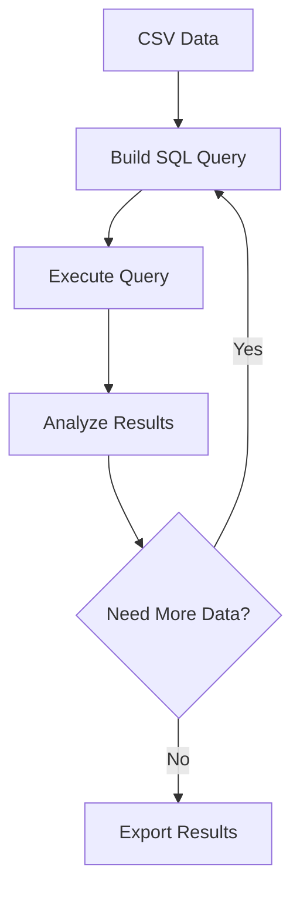

## Overview

This suite of 8 tools provides comprehensive capabilities for statistical analysis, SQL-based querying, and data exploration of genomic datasets.

---

## Statistical Analysis

<AccordionGroup>
  <Accordion title="analyze_csv" icon="chart-simple">
    ### Perform statistical analysis on CSV data
    
    **Usage:** Statistical analysis and data exploration
    
    **Description:**
    Compute descriptive statistics, distributions, correlations, and other summary statistics from CSV data. Provides comprehensive data profiling to understand patterns and outliers in your dataset.
    
    **Analysis Capabilities:**
    - Descriptive statistics (mean, median, std dev)
    - Distribution analysis
    - Correlation matrices
    - Outlier detection
    - Missing value analysis
    - Data quality metrics
    
    **Output Includes:**
    - Summary statistics table
    - Distribution visualizations
    - Correlation heatmaps
    - Quality reports
  </Accordion>
</AccordionGroup>

---

## SQL Query Tools

<AccordionGroup>
  <Accordion title="run_sql_query" icon="database">
    ### Execute SQL queries on genomic datasets
    
    **Usage:** Direct database query execution
    
    **Description:**
    Execute custom SQL queries directly against genomic databases to retrieve specific subsets of data. Enable complex joins, aggregations, and filtering operations on large-scale genomic data.
    
    **Supported Operations:**
    - SELECT with complex WHERE clauses
    - JOIN operations across tables
    - GROUP BY and aggregations
    - Subqueries and CTEs
    - Window functions
    
    **Example Use Cases:**
    ```sql
    -- Find variants with MAF > 0.05 in a specific gene
    SELECT * FROM variants 
    WHERE gene = 'BRCA1' AND maf > 0.05
    ```
  </Accordion>

  <Accordion title="build_sql_query_for_csv" icon="code">
    ### Generate SQL queries from CSV structure
    
    **Usage:** Automated query generation
    
    **Description:**
    Automatically generate SQL queries based on CSV structure and user-specified filtering criteria. Simplifies complex query generation for users unfamiliar with SQL syntax.
    
    **Features:**
    - Automatic schema detection
    - Filter criteria builder
    - Query optimization
    - Syntax validation
    
    **How It Works:**
    1. Analyzes CSV structure and data types
    2. Suggests available columns and operations
    3. Builds optimized SQL query
    4. Validates before execution
  </Accordion>

  <Accordion title="run_sql_query_from_file" icon="file-code">
    ### Execute SQL queries stored in files
    
    **Usage:** File-based query execution
    
    **Description:**
    Load and execute SQL queries from stored files, enabling reproducible analysis and version control of analysis scripts. Supports query templating and parameter substitution.
    
    **Advantages:**
    - Version control for queries
    - Reproducible analysis workflows
    - Template support with parameters
    - Batch query execution
    - Documentation within SQL files
  </Accordion>
</AccordionGroup>

---

## Documentation & Profiling

<AccordionGroup>
  <Accordion title="describe_csv_columns_with_html" icon="file-lines">
    ### Generate HTML descriptions of columns
    
    **Usage:** Column documentation generation
    
    **Description:**
    Generate formatted HTML documentation describing each column in a CSV file including data types, value ranges, and sample data. Useful for creating automated data dictionaries.
    
    **Generated Information:**
    - Column name and data type
    - Value range and distribution
    - Sample values
    - Missing value statistics
    - Unique value counts
  </Accordion>

  <Accordion title="describe_csv_columns_with_html_smart" icon="sparkles">
    ### Generate intelligent HTML descriptions
    
    **Usage:** Advanced column analysis and insights
    
    **Description:**
    Advanced column analysis that infers semantic meaning, identifies patterns, and provides intelligent suggestions for data usage. Includes distribution analysis and anomaly detection.
    
    **Smart Features:**
    - Semantic type inference
    - Pattern recognition
    - Anomaly detection
    - Data quality scoring
    - Usage recommendations
    - Relationship detection
    
    **What Makes It Smart:**
    - Recognizes genomic identifiers (RSIDs, gene names)
    - Detects coordinate systems
    - Identifies phenotype columns
    - Suggests appropriate analyses
  </Accordion>
</AccordionGroup>

---

## Sample Data & Networks

<AccordionGroup>
  <Accordion title="make_example_table" icon="table">
    ### Create example tables for demonstration
    
    **Usage:** Generate sample data tables
    
    **Description:**
    Create representative sample tables from larger datasets for testing, documentation, or demonstration purposes. Preserves data distributions while reducing data volume.
    
    **Use Cases:**
    - Creating documentation examples
    - Testing analysis pipelines
    - Sharing data previews
    - Training and education
    
    **Sampling Methods:**
    - Random sampling
    - Stratified sampling
    - Representative selection
    - Edge case inclusion
  </Accordion>

  <Accordion title="get_gene_network" icon="diagram-project">
    ### Retrieve gene interaction networks
    
    **Usage:** Gene relationship discovery
    
    **Description:**
    Query biological networks to discover functional relationships, protein interactions, and co-expression patterns between genes. Useful for pathway analysis and functional annotation.
    
    **Network Types:**
    - Protein-protein interactions
    - Co-expression networks
    - Regulatory relationships
    - Pathway memberships
    
    **Output Format:**
    - Node attributes (genes/proteins)
    - Edge attributes (interaction types)
    - Network statistics
    - Visualization-ready formats
  </Accordion>
</AccordionGroup>

---

## Workflow Examples

### Data Exploration Workflow

<Steps>
  <Step title="Initial Analysis">
    Use `analyze_csv` to get overview statistics and identify data quality issues
  </Step>
  <Step title="Smart Profiling">
    Run `describe_csv_columns_with_html_smart` for detailed column analysis
  </Step>
  <Step title="Targeted Queries">
    Build and execute SQL queries for specific data subsets
  </Step>
  <Step title="Network Analysis">
    Use `get_gene_network` to explore gene relationships
  </Step>
</Steps>

### SQL-Based Analysis Workflow



---

## Best Practices

<Card title="Query Optimization" icon="gauge-high">
  Start with `build_sql_query_for_csv` to generate optimized queries, then refine manually for complex operations
</Card>

<Card title="Data Profiling" icon="microscope">
  Always run `analyze_csv` before deep analysis to understand data quality and distributions
</Card>

<Card title="Documentation" icon="book">
  Use `describe_csv_columns_with_html_smart` to generate data dictionaries for team collaboration
</Card>

---

## Tips & Tricks

<Tip>
  **Smart Descriptions**: The `describe_csv_columns_with_html_smart` tool can automatically recognize genomic identifiers like RSIDs, gene symbols, and chromosomal coordinates.
</Tip>

<Warning>
  **Large Datasets**: For very large CSV files, consider using SQL queries instead of loading everything into memory with `analyze_csv`.
</Warning>

<Note>
  **Reproducibility**: Store your SQL queries in files using version control for reproducible analysis with `run_sql_query_from_file`.
</Note>
