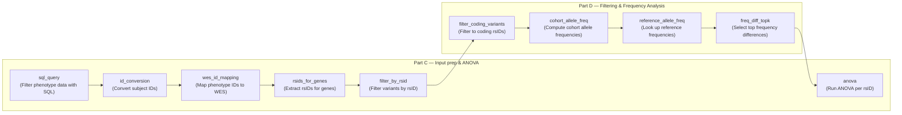

## Overview

This comprehensive suite of 12 tools is specifically designed for performing Analysis of Variance (ANOVA) on genomic data, including variant filtering, frequency analysis, and statistical testing.

---

## Core ANOVA Analysis

<AccordionGroup>
  <Accordion title="anova_analysis" icon="calculator">
    ### Perform ANOVA statistical tests
    
    **Usage:** Statistical variance analysis
    
    **Description:**
    Compare group means with standard ANOVA designs and clear, publication-ready outputs.
    

  </Accordion>

  <Accordion title="plan_anova_inputs" icon="list-check">
    ### Plan and validate ANOVA inputs
    
    **Usage:** Input preparation and validation
    
    **Description:**
    Validate inputs, group structure, and data quality before running ANOVA.
    

  </Accordion>

  <Accordion title="anova_with_vcf" icon="dna">
    ### Run ANOVA on VCF variant data
    
    **Usage:** Variant-based ANOVA analysis
    
    **Description:**
    Run ANOVA directly on VCF genotypes to find variants associated with group differences.
    

  </Accordion>

  <Accordion title="anova_sql_query" icon="database">
    ### Build SQL queries for ANOVA
    
    **Usage:** Database-backed ANOVA operations
    
    **Description:**
    Generate SQL that prepares grouped data for ANOVA at scale without full in‑memory loading.
    

  </Accordion>
</AccordionGroup>

---

## Identifier Management

<AccordionGroup>
  <Accordion title="anova_id_conversion" icon="arrow-right-arrow-left">
    ### Convert identifiers in ANOVA datasets
    
    **Usage:** Identifier mapping for analysis
    
    **Description:**
    Map and convert sample or variant identifiers in ANOVA datasets to ensure consistent naming and proper grouping across different data sources.
    

  </Accordion>

  <Accordion title="anova_wes_id_mapping" icon="id-card">
    ### Map WES sample identifiers
    
    **Usage:** WES data sample mapping
    
    **Description:**
    Manage and convert sample identifiers specific to whole exome sequencing (WES) datasets. Handles mapping between sequencing IDs, clinical IDs, and analysis sample codes.
    

  </Accordion>

  <Accordion title="anova_rsids_for_genes" icon="magnifying-glass-location">
    ### Extract RSIDs for genes
    
    **Usage:** Gene-to-variant mapping
    
    **Description:**
    Retrieve all RSID identifiers (SNP IDs) for variants located within specified genes. Essential for targeted variant analysis and results interpretation.
    

  </Accordion>
</AccordionGroup>

---

## Variant Filtering & Selection

<AccordionGroup>
  <Accordion title="anova_filter_by_rsid" icon="filter">
    ### Filter ANOVA results by RSID
    
    **Usage:** Variant-specific result filtering
    
    **Description:**
    Filter ANOVA results to focus on specific variants of interest identified by their RSID. Enables prioritization of findings for validation and interpretation.
    

  </Accordion>

  <Accordion title="anova_filter_coding_variants" icon="code">
    ### Filter for coding variants
    
    **Usage:** Coding sequence variant selection
    
    **Description:**
    Extract variants that fall within protein-coding sequences from ANOVA results. Prioritizes variants with higher likelihood of functional impact on gene expression.
    

  </Accordion>
</AccordionGroup>

---

## Frequency Analysis

<AccordionGroup>
  <Accordion title="anova_cohort_allele_freq" icon="percentage">
    ### Calculate cohort allele frequencies
    
    **Usage:** Population frequency calculations
    
    **Description:**
    Compute allele frequencies for variants within your study cohort. Useful for assessing variant prevalence and comparing against population databases.
    

  </Accordion>

  <Accordion title="anova_reference_allele_freq" icon="globe">
    ### Get reference population frequencies
    
    **Usage:** Benchmark frequency data
    
    **Description:**
    Retrieve allele frequencies from reference populations (1000 Genomes, gnomAD) for comparison with cohort frequencies. Helps identify variants with unusual population distributions.
    

  </Accordion>

  <Accordion title="anova_freq_diff_topk" icon="ranking-star">
    ### Find top K variants by frequency difference
    
    **Usage:** Variant prioritization by frequency
    
    **Description:**
    Identify the most significantly different variants between study cohort and reference populations ranked by frequency difference. Prioritizes variants with largest effect sizes.
    

  </Accordion>
</AccordionGroup>

---

## Complete ANOVA Workflow

<Steps>
  <Step title="Part C: Input Prep & ANOVA">
    1. <b>sql_query</b> – Filter phenotype data with SQL
    2. <b>id_conversion</b> – Convert subject IDs and prepare phenotype table
    3. <b>wes_id_mapping</b> – Map phenotype IDs to WES column names
    4. <b>rsids_for_genes</b> – Extract rsIDs for gene lists
    5. <b>filter_by_rsid</b> – Filter variants by RSID list
  </Step>
  <Step title="Part D: Filtering & Frequency Analysis">
    6. <b>filter_coding_variants</b> – Filter variants to coding RSIDs only
    7. <b>cohort_allele_freq</b> – Compute cohort allele frequencies
    8. <b>reference_allele_freq</b> – Look up reference population frequencies
    9. <b>freq_diff_topk</b> – Select top frequency differences (two-sided)
    10. <b>anova</b> – Run ANOVA analysis per RSID (final step)
  </Step>
</Steps>

---

## Workflow Diagram

### ANOVA Study Workflow

**Part C Tools:**
- `sql_query` — Filter phenotype data with SQL
- `id_conversion` — Convert subject IDs and prepare phenotype table
- `wes_id_mapping` — Map phenotype IDs to WES column names
- `rsids_for_genes` — Extract rsIDs for gene lists
- `filter_by_rsid` — Filter variants by RSID list

**Part D Tools:**
- `filter_coding_variants` — Filter variants to coding RSIDs only
- `cohort_allele_freq` — Compute cohort allele frequencies
- `reference_allele_freq` — Look up reference population frequencies
- `freq_diff_topk` — Select top frequency differences (two-sided)
- `anova` — Run ANOVA analysis per RSID (final step)

