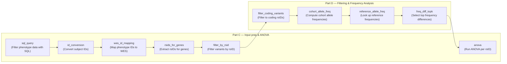

## Overview

This comprehensive suite of 12 tools is specifically designed for performing Analysis of Variance (ANOVA) on genomic data, including variant filtering, frequency analysis, and statistical testing.

## Complete ANOVA Workflow

<Steps>
  <Step title="Part C: Input Prep & ANOVA">
    1. <b>sql_query</b> – Filter phenotype data with SQL
    2. <b>id_conversion</b> – Convert subject IDs and prepare phenotype table
    3. <b>wes_id_mapping</b> – Map phenotype IDs to WES column names
    4. <b>rsids_for_genes</b> – Extract rsIDs for gene lists
    5. <b>filter_by_rsid</b> – Filter variants by RSID list
  </Step>
  <Step title="Part D: Filtering & Frequency Analysis">
    6. <b>filter_coding_variants</b> – Filter variants to coding RSIDs only
    7. <b>cohort_allele_freq</b> – Compute cohort allele frequencies
    8. <b>reference_allele_freq</b> – Look up reference population frequencies
    9. <b>freq_diff_topk</b> – Select top frequency differences (two-sided)
    10. <b>anova</b> – Run ANOVA analysis per RSID (final step)
  </Step>
</Steps>

## Workflow Diagram

### ANOVA Study Workflow

