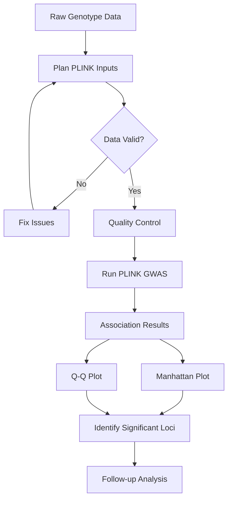

## Overview

This suite of 4 specialized tools supports the complete workflow for Genome-Wide Association Studies (GWAS), from input preparation to result visualization.

---

## Input Preparation

<AccordionGroup>
  <Accordion title="plan_plink_gwas_inputs" icon="list-check">
    ### Plan PLINK GWAS input files
    
    **Usage:** GWAS workflow preparation
    
    **Description:**
    Prepare and validate input files in PLINK format (.bed, .bim, .fam) for genome-wide association studies. Ensures proper formatting and completeness before GWAS analysis.
    
    **File Validation:**
    
    **BED File (.bed):**
    - Binary genotype data validation
    - SNP-major vs individual-major format
    - File integrity checks
    
    **BIM File (.bim):**
    - Chromosome codes
    - Variant identifiers (RSIDs)
    - Genetic/physical positions
    - Allele codes
    
    **FAM File (.fam):**
    - Family/pedigree structure
    - Individual IDs
    - Parental IDs
    - Sex coding
    - Phenotype values
    
    **Quality Checks:**
    - Missing genotype rates
    - Minor allele frequencies
    - Hardy-Weinberg equilibrium
    - Sample call rates
    - Duplicate samples
    - Sex concordance
    
    **Output:**
    - Validation report
    - Quality control recommendations
    - Suggested filtering thresholds
    - Format correction suggestions
  </Accordion>

  <Accordion title="generate_gwas_sample_data" icon="flask">
    ### Create sample GWAS datasets
    
    **Usage:** Test data generation
    
    **Description:**
    Generate synthetic GWAS datasets for testing, demonstration, or educational purposes. Creates realistic data with specified effect sizes and heritability parameters.
    
    **Customizable Parameters:**
    - Number of individuals (N)
    - Number of SNPs (M)
    - MAF distribution
    - Effect sizes
    - Heritability (h²)
    - Number of causal variants
    - Linkage disequilibrium structure
    
    **Use Cases:**
    - Pipeline testing
    - Educational demonstrations
    - Method validation
    - Power calculations
    - Software benchmarking
    
    **Output Formats:**
    - PLINK binary files
    - VCF format
    - Custom text formats
  </Accordion>
</AccordionGroup>

---

## GWAS Analysis

<AccordionGroup>
  <Accordion title="run_plink_gwas" icon="play">
    ### Execute PLINK genome-wide study
    
    **Usage:** Run GWAS analysis
    
    **Description:**
    Execute GWAS analysis using PLINK, testing associations between genetic variants and phenotypes across the entire genome. Includes quality control and multiple testing correction.
    
    **Analysis Pipeline:**
    
    **1. Quality Control:**
    - SNP missingness filtering
    - Individual missingness filtering
    - MAF threshold application
    - HWE filtering
    - Sex check
    - Relatedness check (IBD/PI_HAT)
    
    **2. Association Testing:**
    - Linear regression (quantitative traits)
    - Logistic regression (binary traits)
    - Covariate adjustment
    - Sex-stratified analysis
    - Interaction tests
    
    **3. Statistical Adjustments:**
    - Genomic control (λGC)
    - Principal components adjustment
    - Multiple testing correction (Bonferroni)
    - FDR control
    
    **Input Requirements:**
    ```
    Required:
    - PLINK binary files (.bed, .bim, .fam)
    - Phenotype file (if not in .fam)
    
    Optional:
    - Covariate file
    - Principal components
    - Sample inclusion/exclusion lists
    ```
    
    **Output Files:**
    - Association results (.assoc)
    - Log file (.log)
    - Summary statistics
    - QC reports
    
    **Key Parameters:**
    - `--maf`: Minimum MAF (e.g., 0.01)
    - `--geno`: Max missing genotype rate (e.g., 0.02)
    - `--mind`: Max missing individual rate (e.g., 0.02)
    - `--hwe`: HWE p-value threshold (e.g., 1e-6)
    - `--covar`: Covariate file
  </Accordion>
</AccordionGroup>

---

## Visualization

<AccordionGroup>
  <Accordion title="create_manhattan_plot" icon="chart-scatter">
    ### Generate Manhattan plots
    
    **Usage:** GWAS results visualization
    
    **Description:**
    Create publication-quality Manhattan plots visualizing GWAS results with significant loci highlighted. Enables quick identification of genome-wide significant associations.
    
    **Plot Features:**
    
    **Visual Elements:**
    - Chromosome-wise color coding
    - Genome-wide significance line (p = 5×10⁻⁸)
    - Suggestive significance line (p = 1×10⁻⁵)
    - SNP annotation labels
    - Highlighted regions of interest
    
    **Customization Options:**
    - Point size and transparency
    - Color schemes
    - Axis labels and titles
    - Significance thresholds
    - Gene annotations
    - LD-based coloring
    
    **Additional Plots:**
    - Q-Q plots for p-value distribution
    - Regional association plots
    - LocusZoom-style plots
    - Interactive HTML versions
    
    **Export Formats:**
    - PNG (high resolution)
    - PDF (vector graphics)
    - SVG (web-friendly)
    - Interactive HTML
    
    **Example Usage:**
    ```python
    create_manhattan_plot(
        results_file='gwas_results.assoc',
        output='manhattan.png',
        title='GWAS for Type 2 Diabetes',
        significance_threshold=5e-8,
        highlight_snps=['rs7903146', 'rs10811661']
    )
    ```
  </Accordion>
</AccordionGroup>

---

## Complete GWAS Workflow

<Steps>
  <Step title="Prepare Data">
    Use `plan_plink_gwas_inputs` to validate and prepare your PLINK files
  </Step>
  <Step title="Quality Control">
    Review QC recommendations and apply appropriate filters
  </Step>
  <Step title="Run GWAS">
    Execute `run_plink_gwas` with your chosen parameters and covariates
  </Step>
  <Step title="Visualize Results">
    Generate Manhattan and Q-Q plots with `create_manhattan_plot`
  </Step>
  <Step title="Identify Loci">
    Identify and annotate genome-wide significant loci
  </Step>
  <Step title="Regional Analysis">
    Perform fine-mapping and conditional analysis of significant regions
  </Step>
</Steps>

---

## Workflow Diagram



---

## Quality Control Guidelines

<Card title="SNP Filtering" icon="filter">
  **Recommended Thresholds:**
  - Genotype call rate: > 98% (--geno 0.02)
  - Minor allele frequency: > 1% (--maf 0.01)
  - HWE p-value: > 1×10⁻⁶ (--hwe 1e-6)
</Card>

<Card title="Sample Filtering" icon="users">
  **Recommended Thresholds:**
  - Sample call rate: > 98% (--mind 0.02)
  - Relatedness: Remove one from pairs with PI_HAT > 0.185
  - Population outliers: > 6 SD from mean on PC1/PC2
</Card>

<Card title="Association Analysis" icon="chart-line">
  **Significance Thresholds:**
  - Genome-wide significant: p < 5×10⁻⁸
  - Suggestive: p < 1×10⁻⁵
  - Genomic inflation factor (λ): 0.95 - 1.05 (acceptable)
</Card>

---

## Best Practices

<Note>
  **Population Stratification**: Always include principal components (typically first 10 PCs) as covariates to control for population structure
</Note>

<Tip>
  **Sample Size**: GWAS power depends heavily on sample size. For common variants (MAF > 5%), aim for N > 5,000 for adequate power
</Tip>

<Warning>
  **Multiple Testing**: Remember that testing ~1 million SNPs requires stringent significance thresholds to control Type I error
</Warning>
