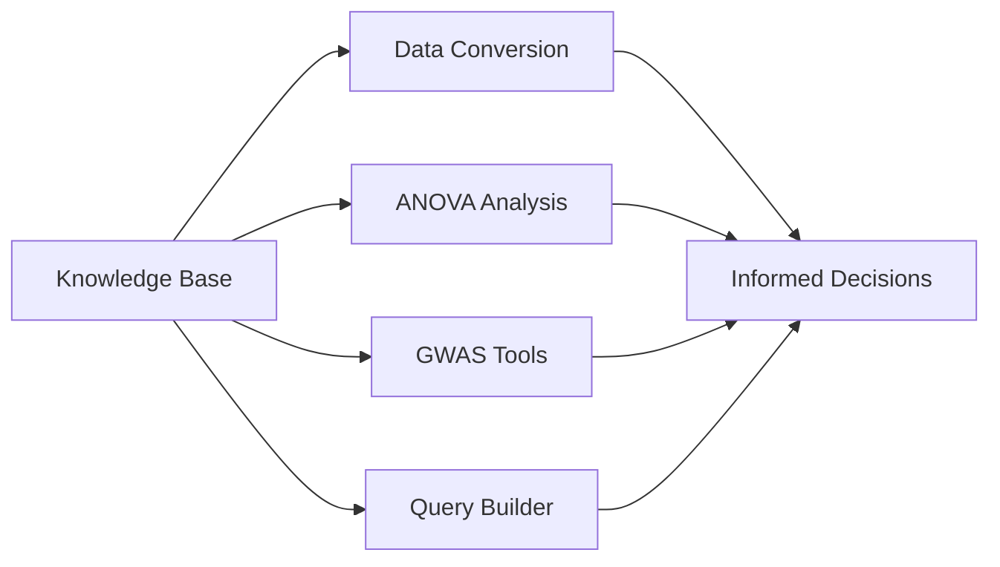

## Overview

The Knowledge Base tool provides intelligent, context-aware search capabilities using Retrieval-Augmented Generation (RAG) technology to help you find relevant genomic information quickly and accurately.

---

## Search Knowledge Base

<Card title="search_knowledge_base" icon="magnifying-glass">
  ### Search knowledge base using RAG
  
  **Usage:** Semantic search and information retrieval
  
  **Description:**
  Perform semantic search across genomic knowledge bases using retrieval-augmented generation (RAG). Find relevant information about genes, variants, and genomic concepts through natural language queries.
</Card>

---

## How It Works

<Steps>
  <Step title="Query Submission">
    Submit your question or search term in natural language
  </Step>
  <Step title="Semantic Understanding">
    RAG engine analyzes the semantic meaning of your query
  </Step>
  <Step title="Knowledge Retrieval">
    Relevant information is retrieved from the knowledge base
  </Step>
  <Step title="Context Integration">
    Retrieved information is synthesized into a coherent answer
  </Step>
  <Step title="Response Generation">
    Receive a comprehensive, context-aware response
  </Step>
</Steps>

---

## Key Features

<CardGroup cols={2}>
  <Card title="Natural Language" icon="comments">
    Ask questions in plain English without needing to know technical query syntax
  </Card>
  <Card title="Semantic Search" icon="brain">
    Finds relevant information even when exact keywords don't match
  </Card>
  <Card title="Context-Aware" icon="lightbulb">
    Understands the context and intent behind your queries
  </Card>
  <Card title="Comprehensive Coverage" icon="database">
    Searches across genes, variants, diseases, pathways, and more
  </Card>
</CardGroup>

---

## Query Examples

### Gene Information
```
"What is the function of BRCA1?"
"Tell me about TP53 mutations in cancer"
"Where is the APOE gene located?"
```

### Variant Information
```
"What disease is rs7903146 associated with?"
"Explain the clinical significance of c.2573T>G in BRAF"
"What is the population frequency of rs1801133?"
```

### Disease & Phenotypes
```
"What genes are associated with Alzheimer's disease?"
"Common variants in type 2 diabetes"
"Genetic causes of familial hypercholesterolemia"
```

### Pathway & Function
```
"What genes are in the MAPK signaling pathway?"
"How does the DNA repair pathway work?"
"Genes involved in insulin resistance"
```

### Technical Concepts
```
"What is Hardy-Weinberg equilibrium?"
"Explain linkage disequilibrium"
"What is a genome-wide significance threshold?"
```

---

## Search Capabilities

<AccordionGroup>
  <Accordion title="Gene Information" icon="dna">
    **Available Information:**
    - Gene function and description
    - Chromosomal location
    - Associated diseases
    - Protein products
    - Expression patterns
    - Pathway memberships
    - Interaction partners
    - Alternative names/aliases
  </Accordion>

  <Accordion title="Variant Information" icon="circle-dot">
    **Available Information:**
    - RSID and variant identifiers
    - Genomic coordinates
    - Allele frequencies
    - Clinical significance
    - Functional impact predictions
    - Disease associations
    - Population distributions
    - Literature references
  </Accordion>

  <Accordion title="Disease Associations" icon="stethoscope">
    **Available Information:**
    - Associated genes and variants
    - Inheritance patterns
    - Prevalence information
    - Genetic risk factors
    - Diagnostic criteria
    - Therapeutic targets
    - Clinical guidelines
  </Accordion>

  <Accordion title="Pathway Information" icon="diagram-project">
    **Available Information:**
    - Pathway members (genes/proteins)
    - Biological processes
    - Cellular locations
    - Regulatory mechanisms
    - Disease associations
    - Drug targets
    - Cross-pathway interactions
  </Accordion>

  <Accordion title="Methodology Guidance" icon="book-open">
    **Available Information:**
    - Analysis workflows
    - Best practices
    - Quality control guidelines
    - Statistical methods
    - Interpretation strategies
    - Common pitfalls
    - Tool recommendations
  </Accordion>
</AccordionGroup>

---

## Understanding Search Results

### Result Components

<Steps>
  <Step title="Relevance Score">
    Results are ranked by relevance to your query
  </Step>
  <Step title="Source Attribution">
    Information includes references to original sources
  </Step>
  <Step title="Context">
    Results include surrounding context for better understanding
  </Step>
  <Step title="Related Concepts">
    Links to related topics for further exploration
  </Step>
</Steps>

### Evaluating Results

<Checklist>
  - [ ] Check the relevance score and ranking
  - [ ] Verify source attribution and references
  - [ ] Cross-reference with external databases
  - [ ] Consider the publication date of information
  - [ ] Look for consensus across multiple sources
</Checklist>

---

## Integration with Other Tools

The knowledge base seamlessly integrates with other platform tools:



**Example Workflows:**

1. **Search** for gene function → **Filter** VCF by those genes
2. **Learn** about ANOVA assumptions → **Plan** ANOVA inputs correctly
3. **Discover** disease-associated variants → **Extract** them from your data
4. **Understand** QC metrics → **Validate** your GWAS inputs

---

## Tips & Tricks

<Tip>
  **Abbreviations**: The system understands common genomic abbreviations (SNP, GWAS, MAF, LD, etc.)
</Tip>

<Tip>
  **Alternative Names**: Search using gene aliases, old nomenclature, or common names—the system will map them correctly
</Tip>

<Tip>
  **Refine Searches**: If results are too broad, add more specific constraints to your query
</Tip>

<Tip>
  **Ask "How-To"**: Don't just search for definitions—ask procedural questions like "How do I..." or "What is the best way to..."
</Tip>

---

## Limitations & Considerations

<Warning>
  **Information Currency**: Knowledge base is periodically updated; for the very latest findings, consult primary literature
</Warning>

<Note>
  **Clinical Use**: This tool is for research purposes. Clinical decisions should be made with appropriate healthcare professionals
</Note>

<Note>
  **Population Specificity**: Frequency and association data may vary by population; specify population when relevant
</Note>

---

## FAQ

<AccordionGroup>
  <Accordion title="How current is the knowledge base?" icon="clock">
    The knowledge base is regularly updated with information from major genomic databases and literature. Update frequency varies by source but typically ranges from weekly to quarterly updates.
  </Accordion>

  <Accordion title="Can I search with gene aliases?" icon="signature">
    Yes! The system recognizes gene aliases, previous symbols, and alternative names. For example, searching for "PARK8" will correctly map to "LRRK2".
  </Accordion>

  <Accordion title="What if I get no results?" icon="circle-xmark">
    Try:
    - Broadening your query
    - Using alternative names or terms
    - Checking spelling
    - Breaking complex queries into simpler parts
  </Accordion>

  <Accordion title="Can I save or export search results?" icon="download">
    Search results can be referenced in your analysis documentation. For persistent storage, copy relevant information into your project notes.
  </Accordion>
</AccordionGroup>

---

## Related Resources

<CardGroup cols={2}>
  <Card title="Gene Databases" icon="database">
    - NCBI Gene
    - Ensembl
    - HGNC
    - OMIM
  </Card>
  <Card title="Variant Databases" icon="dna">
    - dbSNP
    - ClinVar
    - gnomAD
    - COSMIC
  </Card>
  <Card title="Literature" icon="book">
    - PubMed
    - Google Scholar
    - BioRxiv
    - MedRxiv
  </Card>
  <Card title="Clinical Resources" icon="hospital">
    - ClinGen
    - PharmGKB
    - GTR
    - MedGen
  </Card>
</CardGroup>
