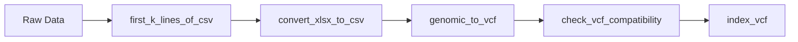
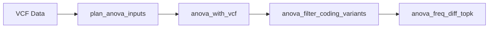

## All Tools at a Glance

Quick reference table of all available tools organized by category.

---

## Data Conversion & Processing (12 tools)

| Tool | Description | Primary Use |
|------|-------------|-------------|
| `first_k_lines_of_csv` | Preview first K lines of CSV | Data preview and structure understanding |
| `csv_to_vcf` | Convert CSV to VCF format | Format conversion for genomic analysis |
| `convert_xlsx_to_csv` | Transform Excel to CSV | Format conversion between delimited files |
| `convert_tsv_to_csv` | Convert TSV to CSV | Format conversion between delimited files |
| `create_csv_from_data` | Generate CSV from structured data | Create datasets from query results |
| `genomic_to_vcf` | Convert genomic formats to VCF | Standardize genomic file formats |
| `check_vcf_compatibility` | Validate VCF file compliance | File validation and format checking |
| `convert_ids_in_csv_using_vcf` | Map identifiers using VCF | Identifier mapping and conversion |
| `index_vcf` | Create VCF index files | Optimize VCF file access and querying |
| `filter_vcf_by_rsids` | Filter variants by RSIDs | Extract relevant variants from VCF |
| `filter_vcf_by_genes` | Extract variants from genes | Gene-based variant filtering |

<Card title="View Detailed Documentation" icon="book" href="/tools/data-conversion">
  Complete guide with examples and workflows
</Card>

---

## Analysis & Querying (8 tools)

| Tool | Description | Primary Use |
|------|-------------|-------------|
| `analyze_csv` | Statistical analysis on CSV | Statistical analysis and data exploration |
| `run_sql_query` | Execute SQL on genomic data | Direct database query execution |
| `build_sql_query_for_csv` | Generate SQL from CSV structure | Automated query generation |
| `run_sql_query_from_file` | Execute stored SQL queries | File-based query execution |
| `describe_csv_columns_with_html` | Generate column documentation | Column documentation generation |
| `describe_csv_columns_with_html_smart` | Intelligent column analysis | Advanced column analysis and insights |
| `make_example_table` | Create sample tables | Generate sample data tables |
| `get_gene_network` | Retrieve gene interactions | Gene relationship discovery |

<Card title="View Detailed Documentation" icon="book" href="/tools/analysis-querying">
  Complete guide with examples and workflows
</Card>

---

## ANOVA Tools (12 tools)

| Tool | Description | Primary Use |
|------|-------------|-------------|
| `anova_analysis` | Perform ANOVA tests | Statistical variance analysis |
| `plan_anova_inputs` | Validate ANOVA inputs | Input preparation and validation |
| `anova_with_vcf` | ANOVA on VCF data | Variant-based ANOVA analysis |
| `anova_sql_query` | Build SQL for ANOVA | Database-backed ANOVA operations |
| `anova_id_conversion` | Convert identifiers | Identifier mapping for analysis |
| `anova_wes_id_mapping` | Map WES sample IDs | WES data sample mapping |
| `anova_rsids_for_genes` | Extract RSIDs for genes | Gene-to-variant mapping |
| `anova_filter_by_rsid` | Filter by RSID | Variant-specific result filtering |
| `anova_filter_coding_variants` | Filter coding variants | Coding sequence variant selection |
| `anova_cohort_allele_freq` | Calculate cohort frequencies | Population frequency calculations |
| `anova_reference_allele_freq` | Get reference frequencies | Benchmark frequency data |
| `anova_freq_diff_topk` | Top K by frequency diff | Variant prioritization by frequency |

<Card title="View Detailed Documentation" icon="book" href="/tools/anova">
  Complete guide with examples and workflows
</Card>

---

## GWAS Tools (4 tools)

| Tool | Description | Primary Use |
|------|-------------|-------------|
| `plan_plink_gwas_inputs` | Plan PLINK inputs | GWAS workflow preparation |
| `run_plink_gwas` | Execute GWAS analysis | Run GWAS analysis |
| `create_manhattan_plot` | Generate Manhattan plots | GWAS results visualization |
| `generate_gwas_sample_data` | Create sample datasets | Test data generation |

<Card title="View Detailed Documentation" icon="book" href="/tools/gwas">
  Complete guide with examples and workflows
</Card>

---

## Knowledge Base (1 tool)

| Tool | Description | Primary Use |
|------|-------------|-------------|
| `search_knowledge_base` | RAG-powered search | Semantic search and information retrieval |

<Card title="View Detailed Documentation" icon="book" href="/tools/knowledge">
  Complete guide with examples and workflows
</Card>

---

## Common Workflows

### Basic Data Processing

### GWAS Analysis Pipeline

### ANOVA Study Workflow

---

## Tool Selection Guide

<AccordionGroup>
  <Accordion title="I need to convert file formats" icon="arrow-right-arrow-left">
    **Start with Data Conversion & Processing tools:**
    - Excel to CSV: `convert_xlsx_to_csv`
    - TSV to CSV: `convert_tsv_to_csv`
    - CSV to VCF: `csv_to_vcf`
    - Any genomic format to VCF: `genomic_to_vcf`
  </Accordion>

  <Accordion title="I need to analyze my data statistically" icon="chart-simple">
    **Use Analysis & Querying or ANOVA tools:**
    - General statistics: `analyze_csv`
    - Group comparisons: `anova_analysis`
    - Variant associations: `anova_with_vcf`
    - Custom queries: `run_sql_query`
  </Accordion>

  <Accordion title="I need to run a GWAS" icon="dna">
    **Use GWAS Tools in sequence:**
    1. `plan_plink_gwas_inputs` - Validate inputs
    2. `run_plink_gwas` - Run analysis
    3. `create_manhattan_plot` - Visualize results
  </Accordion>

  <Accordion title="I need to filter variants" icon="filter">
    **Multiple filtering options available:**
    - By RSIDs: `filter_vcf_by_rsids` or `anova_filter_by_rsid`
    - By genes: `filter_vcf_by_genes`
    - Coding variants only: `anova_filter_coding_variants`
  </Accordion>

  <Accordion title="I need to find information" icon="magnifying-glass">
    **Use the Knowledge Base:**
    - `search_knowledge_base` - Natural language search for any genomic concept
  </Accordion>
</AccordionGroup>

---

## Filter Tools by Feature

### Supports VCF Files
- `csv_to_vcf`
- `genomic_to_vcf`
- `check_vcf_compatibility`
- `index_vcf`
- `filter_vcf_by_rsids`
- `filter_vcf_by_genes`
- `convert_ids_in_csv_using_vcf`
- `anova_with_vcf`

### Statistical Analysis
- `analyze_csv`
- `anova_analysis`
- `plan_anova_inputs`
- `anova_with_vcf`
- `run_plink_gwas`

### Frequency Calculations
- `anova_cohort_allele_freq`
- `anova_reference_allele_freq`
- `anova_freq_diff_topk`

### Visualization
- `create_manhattan_plot`
- `describe_csv_columns_with_html`
- `describe_csv_columns_with_html_smart`

### SQL/Database
- `run_sql_query`
- `build_sql_query_for_csv`
- `run_sql_query_from_file`
- `anova_sql_query`

---

## Need Help Choosing?

<CardGroup cols={2}>
  <Card title="Tools Overview" icon="toolbox" href="/tools/overview">
    High-level overview and common workflows
  </Card>
  <Card title="Search Knowledge Base" icon="book" href="/tools/knowledge">
    Ask questions about which tool to use
  </Card>
  <Card title="Data Conversion" icon="arrow-right-arrow-left" href="/tools/data-conversion">
    File format conversion and processing
  </Card>
  <Card title="Analysis Tools" icon="magnifying-glass-chart" href="/tools/analysis-querying">
    Statistical analysis and querying
  </Card>
</CardGroup>
